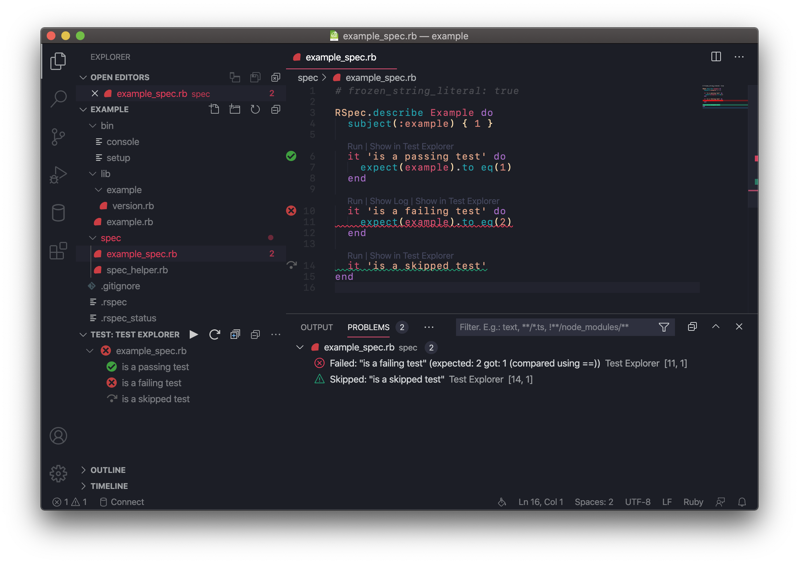

Test Explorer Diagnostics Controller
====================================

This repository contains the source code for the Test Explorer Diagnostics Controller extension for Visual Studio Code. It is meant to work with the [Test Explorer extension](https://marketplace.visualstudio.com/items?itemName=hbenl.vscode-test-explorer).

Using the test states known to the Test Explorer, it populates diagnostics in Visual Studio Code. These appear in the Problems panel. See the screenshot below as an example.

Status
------

This extension should be considered early alpha. It should work, but I have barely tested it in various scenarios, and much remains to do.

### To do ###

* Handle retired test states fully.
* Add suggestions for preferences in Test Explorer to set.
* Discover proper ranges to provide diagnostics.
* Custom extension icon.
* Allow user to customize formatting of diagnostics.